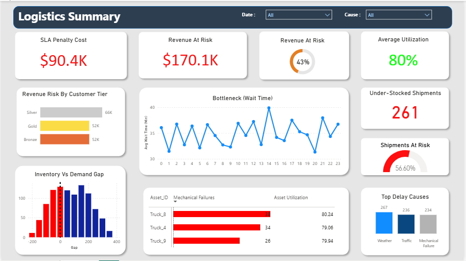

# 🚛 Smart Logistics Delay Report

## 📌 Executive Summary
The **Smart Logistics Delay Report** is a specialized Power BI analytic solution designed to diagnose and mitigate supply chain disruptions.

By integrating Financial, Operational, and Planning metrics into a unified view, this dashboard enables stakeholders to:
* **Quantify Delay Impact:** Track $170K+ in revenue currently at risk due to logistics failures.
* **Identify Bottlenecks:** Pinpoint critical failure times (e.g., 2 PM peak) and unreliable assets (Truck_8).
* **Optimize Planning:** Analyze the gap between inventory levels and demand forecasts to prevent stockouts.

---

## 🏗️ Project Architecture
* **Platform:** Power BI Desktop , MS SQL Server
* **Data Source:** Smart Logistics Dataset (CSV)
* **Key Visuals:** Grid-layout Dashboard.

###  **3-Pillar Analytics Framework**
The dashboard is structured into three core analytical domains:

1. **Financial Health**
   - Revenue at risk due to delays
   - SLA penalty costs
2. **Fleet & Operations**
   - On-time delivery performance
   - Delay reasons & mechanical failure tracking
   - Fleet utilization insights
3. **Demand Planning**
   - Inventory vs. forecast gap analysis
   - Stockout and under-stock risks

---
## 📊 Key Features

### 🔹 Cross-Functional Insights
- Combines finance, operations, and planning metrics
- Enables multi-angle view of logistics performance

### 🔹 Dynamic Interactivity
- Delay reasons filters
- Customer segment segmentation

### 🔹 Advanced DAX Logic
The report uses extensive DAX measures for accurate KPI calculation, including:
- On-Time Shipment rates
- Revenue at Risk
- SLA Penalty computation
- Gold customer shipment analysis

📄 See **DAX-Measures.md** for detailed formulas and business definitions.

---
## 📈 Business Value

This analytical solution enables logistics and supply chain teams to:

- Identify delay drivers and high-risk delivery windows
- Quantify financial impact of logistics delays
- Improve planning decisions using real-time metrics
- Enhance customer satisfaction through actionable insights

